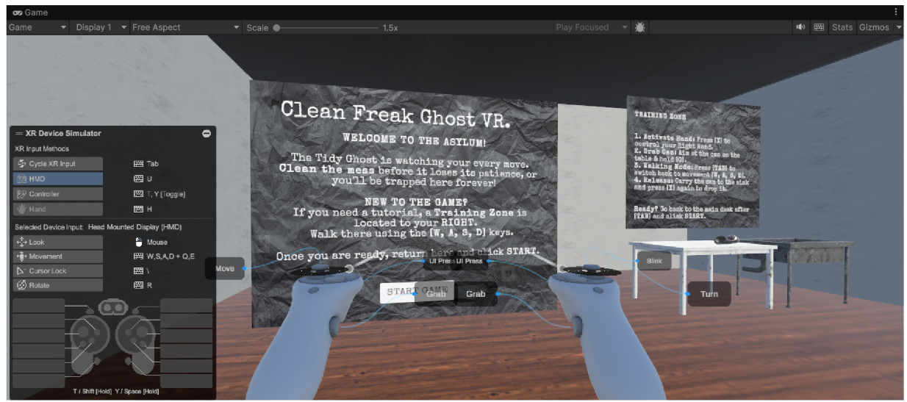
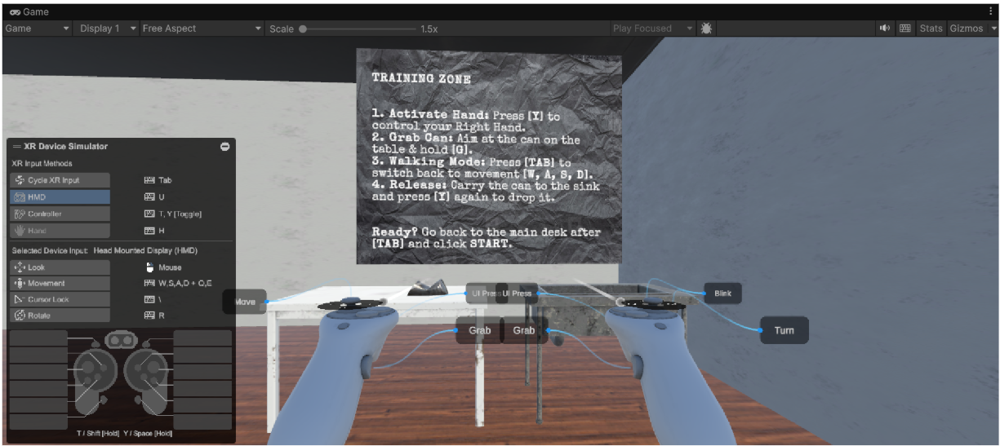
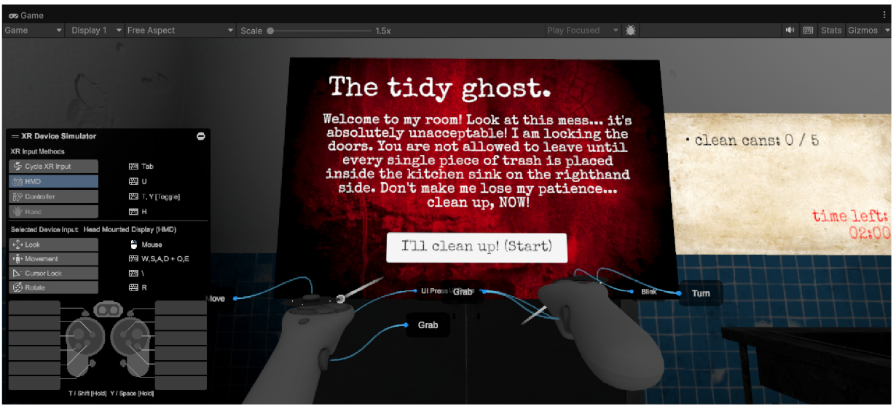
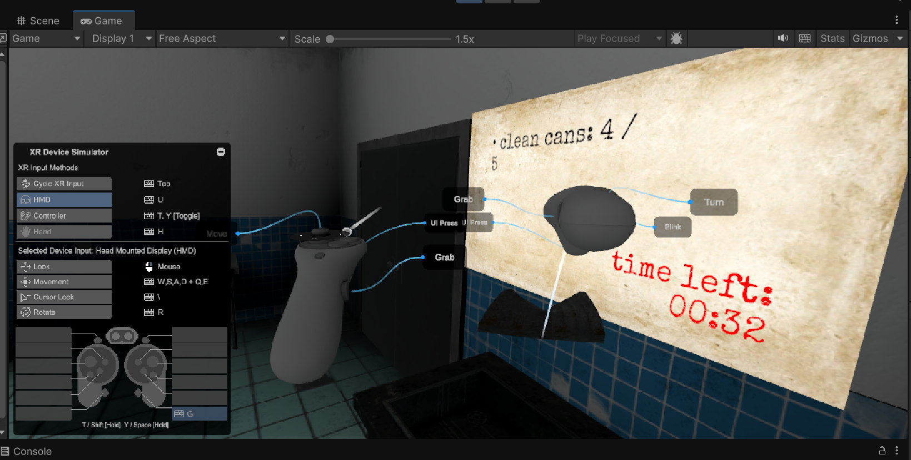
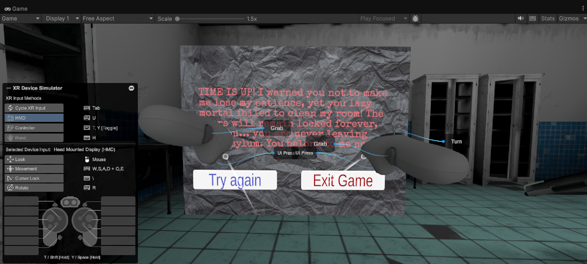
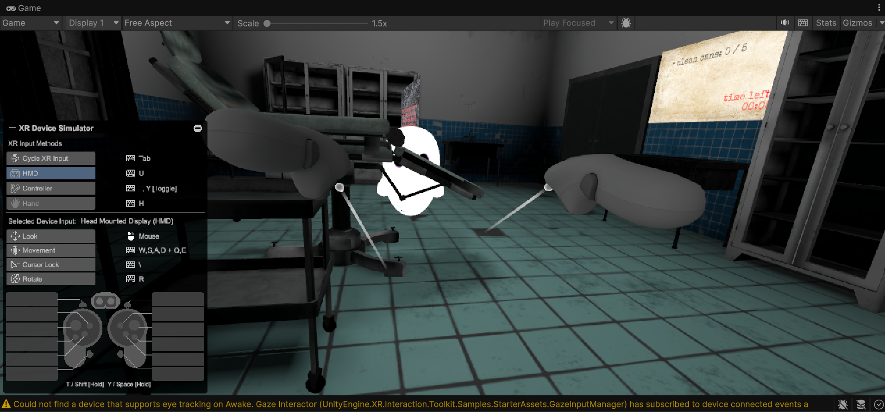
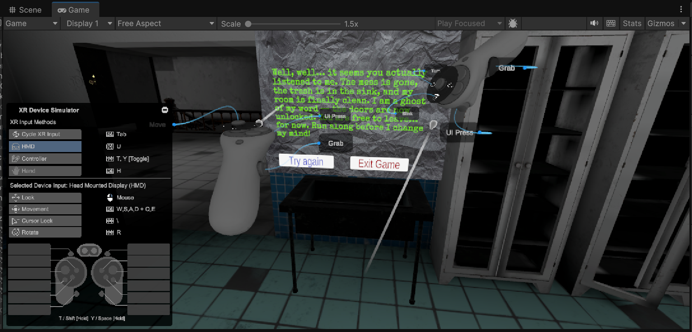

# 👻 Clean Freak Ghost - VR Escape Room

A Virtual Reality horror-comedy escape room game built in **Unity 6** using the **XR Interaction Toolkit (XRI 3.0)**. 

---

## 🎮 Game concept
You suddenly wake up in a dark, messy room and quickly realize you are not alone. You've been trapped by the **Clean Freak Ghost** — a spirit with severe OCD when it comes to tidiness! 🧹

The ghost refuses to let you leave until the entire place is absolutely spotless. The deal is simple: clean up the room according to the checklist, and the locked doors will magically vanish, granting you freedom. You have exactly **2 minutes** to get the job done. If you take too long, the ghost will completely lose its patience, materialize right in front of you, and personally execute a nasty jumpscare sequence.

---

## 🛠️ What's inside? (current implementation)

The game is 100% complete with a fully functional gameplay loop:

* **Two Playable Scenes:** * `MainMenu` – An atmospheric starter lobby featuring a dedicated **Training Zone** where you can safely test the controls and grab mechanics before diving into the actual game.
    * `EscapeRoom` – The main gameplay scene with the ticking clock.
* **Grab Mechanics & Physics:** Full VR controller support driven by the `XR Origin Hands` architecture. The 5 old trash cans scattered around the room are equipped with `XR Grab Interactable` components, allowing you to physically pick up, carry, and throw them.
* **World Space UI:** All interfaces and TextMeshPro boards are rendered strictly in World Space to maintain full VR immersion. Customized canvases using the *Special Elite* font and grunge/blood textures deliver a perfect horror vibe.
* **Dynamic Dashboard:** A live display tracking your remaining time (2-minute countdown) and a real-time updating objective checklist ("Cans Remaining: X/5").
* **Win/Lose Conditions:**
    * *Win:* Dropping all 5 cans into the sink area (`Sink_V1`) before time runs out triggers a victory screen and makes the exit doors disappear so you can escape.
    * *Lose:* If the timer hits zero, the ambient music cuts out, the ghost spawns, and after a tense 5-second delay, it charges straight at you while screaming and clipping through the UI.
* **Dynamic Audio System:** Features synchronized footsteps that play only when moving the analog joystick, 3D spatialized sound effects for throwing trash into the sink, creepy environmental drones, and contextual end-game tracks.

---

## 📸 Screenshots from the game

### 1. Welcome to the Lobby
| Main Menu Board | Training Zone Practice |
| :---: | :---: |
|  |  |

### 2. The Escape Room Gameplay
| Ghost's Welcome Note | Cleaning in Progress (UI & Grab) |
| :---: | :---: |
|  |  |

### 3. Endgame Scenarios
| Out of Time (Lose Screen) | He's Coming! (Jumpscare) | The Sweet Escape (Win Screen) |
| :---: | :---: | :---: |
|  |  |  |

---

## 📽️ Gameplay videos
Don't have a VR headset on hand? No worries. You can check out full gameplay recordings (showcasing both the winning run and the losing scenario with the jumpscare) right here (PS: turn on your speakers cause the game has some background music and sound effects!!):  
👉 **[Google Drive - gameplay videos folder](https://drive.google.com/drive/folders/1olYEFdMgy1wRWRp521Bu8nGPCcOwAVjj?usp=sharing)**

---

## 📦 Third-Party Assets used
All utilized packages are sourced from the Unity Asset Store and adhere to the Standard Unity Asset Store EULA:

* **Environment:** [Abandoned Asylum](https://assetstore.unity.com/packages/3d/environments/urban/abandoned-asylum-49137) – Walls, table, sink, and the trash cans.
* **Character:** [Ghost Character Free](https://assetstore.unity.com/packages/3d/characters/creatures/ghost-character-free-267003) – 3D model and animations for our terrifyingly tidy ghost.
* **Ambient Music:** [Free Horror Ambience 2](https://assetstore.unity.com/packages/audio/music/free-horror-ambience-2-215651) – Immersive horror music.
* **Win/Lose Music:** [Backrooms Music Pack](https://assetstore.unity.com/packages/audio/music/backrooms-music-pack-backrooms-forever-341024) – Dynamic endgame contextual tracks.
* **SFX (Footsteps):** [Footsteps Sounds Volume 02](https://assetstore.unity.com/packages/audio/sound-fx/footsteps-sounds-volume-02-351282) – Locomotion footsteps clips.
* **SFX (Disposal):** [Blades & Bludgeoning Free Sample Pack](https://assetstore.unity.com/packages/audio/sound-fx/blades-bludgeoning-free-sample-pack-179306) – Metal collision sound when trash hits the sink.

---

## 🎓 Course Info
This project was developed and submitted as a **final project** for the **Virtual Reality** course at university.  
The compiled Android executable (**`.apk`**) will be compiled in the future and will be ready for direct deployment onto a VR headset (e.g., Meta Quest via SideQuest) and will be found in the **Releases** section of this repository.
